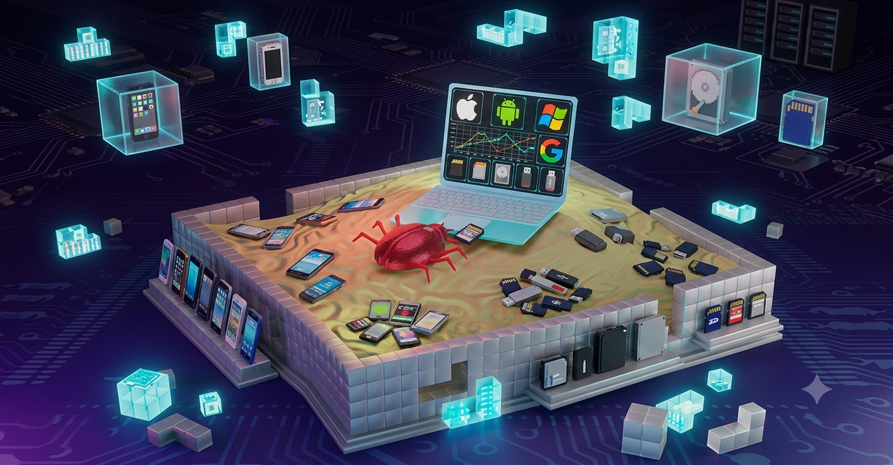

<p align="center">
  
</p>

<p align="center">
  <a href="https://opensource.org/licenses/MIT"></a>
  <a href="https://github.com/darnellwashingtonjr94-art/SandB0x-Xtract0r/actions/workflows/test.yml"></a>
  <a href="https://github.com/darnellwashingtonjr94-art/SandB0x-Xtract0r/actions/workflows/docker.yml"></a>
<a href="https://hub.docker.com/r/darnellwashingtonjr94-art/sandbox-api"></a>

</p>

<h1 align="center">SandB0x-Xtract0r</h1>

<p align="center">
  <strong>An automated, cross-platform security analysis engine for safely detonating suspicious files, binaries, and applications.</strong><br>
  <a href="https://labs.google/fx/tools/flow/shared/video/d3be83b0-0d20-4747-9945-b81cdac74179">🎬 Watch the Project Demo</a>
</p>

---

## Tech Stack

### Core Programming Languages, Core Systems


### Platform Support & Hardware Architecture


### Low-Level Infrastructure & Performance


### Cybersecurity & Offensive Auditing


### DevOps & Build Tools


### Artificial Intelligence & Quantum


### Cloud Providers


</div>

---

## 📖 What is this?

**SandB0x-Xtract0r** provides a unified environment to execute payloads across PC, mobile, and cloud environments. While the payload executes, the system captures runtime telemetry, network traces, and memory dumps, which are then synthesized into structured threat reports by an integrated multi-LLM bot.

### 💡 Simplified Summary
Imagine you find a mystery package on your porch, but you aren't sure if it's a cool toy or a messy glitter bomb. Instead of opening it in your living room, you put the package inside a thick, clear plastic box in your backyard. You use robotic arms to open it while cameras record exactly what happens. If it explodes, the mess stays completely trapped, and your house is safe!

**SandB0x-Xtract0r** is that clear plastic box for computer files. It puts a mystery file inside a fake, trapped computer, watches everything it does, takes notes, and uses a smart AI robot to read those notes and tell you exactly how dangerous the file was.

---

## ✨ Core Features

* **Dynamic Detonation:** Safely executes malware, scripts, and applications targeting Windows, Linux, Android, iOS, and cloud containers.
* **Deep Telemetry Extraction:** Monitors and captures real-time system calls (via eBPF), network traffic (PCAPs), filesystem modifications, and RAM artifacts (memory dumping).
* **AI-Powered Synthesis:** Feeds raw execution telemetry into a multi-LLM gateway (utilizing Gemini, Claude, and OpenAI) to translate complex hexadecimal and machine-level behaviors into readable, MITRE ATT&CK-mapped threat intelligence reports.
* **Automated Orchestration:** Uses a Celery and Redis task queue to manage multiple sandbox environments concurrently without bottlenecking the main API.

---

## 🛠️ How does this work?

1. **Submission:** A user uploads a suspicious file via the React-based frontend UI or directly through the FastAPI endpoint.
2. **File Routing:** The Orchestrator inspects the file's magic bytes to automatically detect the target platform (e.g., routing an APK to the Redroid Android emulator, or an ELF file to a Linux Firecracker microVM).
3. **Execution & Tracing:** The payload is injected into the highly isolated sandbox. Hooks record API calls, network requests, and spawned processes.
4. **Data Normalization:** Once the execution times out or completes, the Extractor module pulls the raw data (PCAPs, memory strings, registry edits) and normalizes it.
5. **LLM Analysis:** The normalized telemetry is sent to the `llm_bot`, which queries the configured AI models to write a comprehensive security assessment.
6. **Reporting:** The user receives a detailed Markdown or PDF report detailing the payload's intent, lateral movement, and C2 (Command and Control) activity.

---

## 🎯 What problems does this solve?

* **Platform Fragmentation:** Security researchers usually need entirely different toolchains to analyze an Android APK versus a Windows executable. SandB0x-Xtract0r centralizes all analysis into one pipeline.
* **Information Overload:** Sifting through thousands of lines of raw system calls and unreadable memory dumps is exhausting. The multi-LLM integration does the heavy lifting, instantly surfacing the most critical threats.
* **Infrastructure Management:** Automatically spins up, resets, and tears down virtualization environments (QEMU, Redroid, Corellium) for every single run, ensuring a clean slate and preventing cross-contamination.

---

## 💻 Installation & Setup

**Prerequisites:** Docker, Docker Compose, and a Linux host (recommended for KVM/hardware acceleration).

### 1. Clone the repository
```bash
git clone https://github.com/darnellwashingtonjr94-art/Sandb0x-Xtract0r.git (https://github.com/darnellwashingtonjr94-art/Sandb0x-Xtract0r.git)
cd Sandb0x-Xtract0r

### 2. Configuration & Environment Setup
Before running the sandbox pipeline, you must configure your API keys and environment variables. A template file (⁠.env.example⁠) is provided in the root repository.

cp .env.example .env

(Edit the new ⁠.env⁠ file with your preferred text editor to add your specific API keys and paths).

🚀 Quick Start (One-Command Docker Setup)
The sandbox architecture consists of multiple services (Orchestrator, Celery Worker, Redis, and Redroid Android Sandbox) connected via Docker Compose.
To build and spin up the entire sandbox environment in detached mode, run: